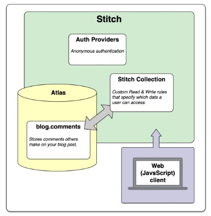

# MongoDB “Hands On” Stitch Tutorial
## [MongoDB Atlanta.local](https://www.mongodb.com/local/atlanta)
### May 1, 2019

The purpose of the tutorial is to walk the user through creating real applications with
MongoDB Stitch.  Follow along to get practical experience working with Stitch, or use
one of the completed applications as a starting point to build your own application.  

MongoDB Stitch Tutorials [Home](https://docs.mongodb.com/stitch/tutorials/) 

Specifically, this tutorial is for building a Basic Blog using MongoDB Stitch.

[Blog App Overview](https://docs.mongodb.com/stitch/tutorials/blog-overview/)  

### Blog App Achitecture  

  

Follow along the step-by-step instructions for the Blog App by following the documentation
that is located here:  https://docs.mongodb.com/stitch/tutorials/guides/blog-backend/

The original version of the HTML file is located within this tutorial here:      

